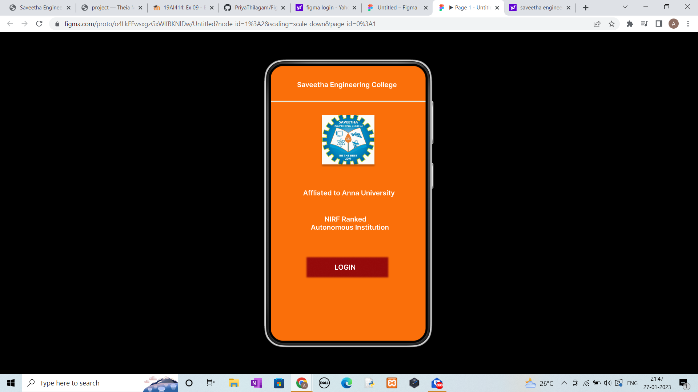
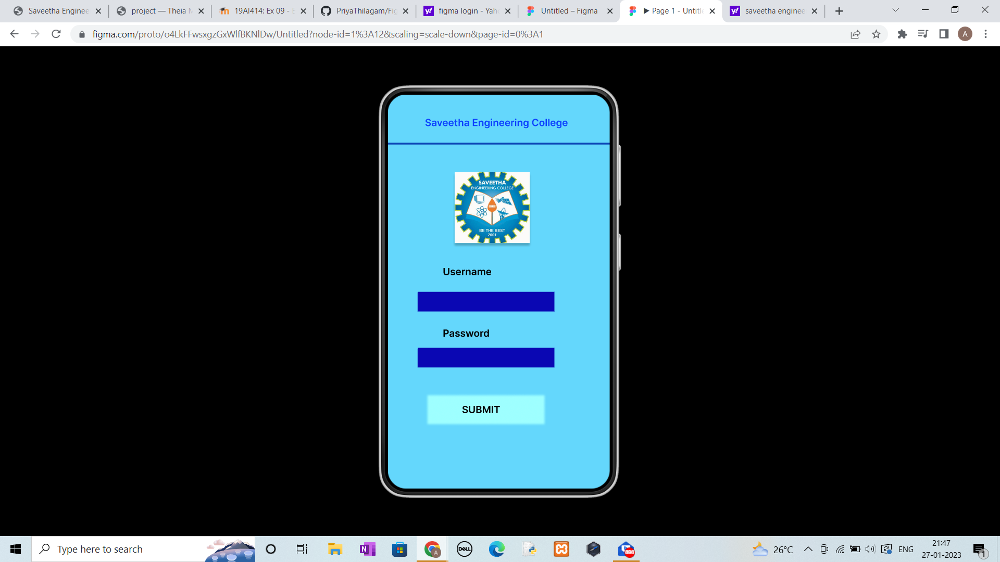
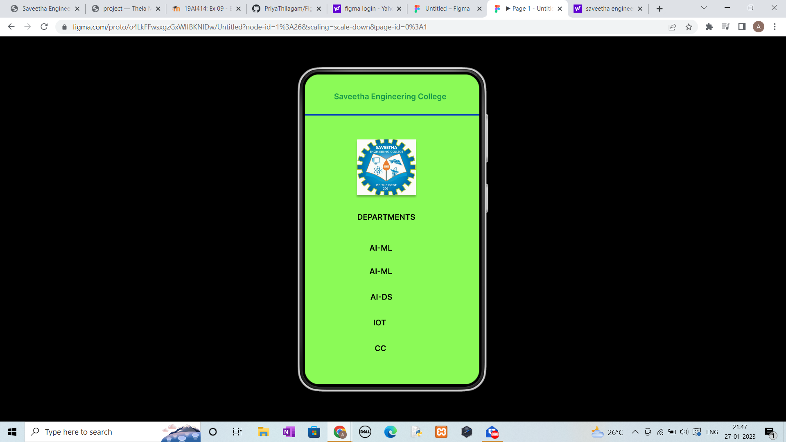

# Event Registration Web Application

## AIM:
To design, develop and deploy a web application for event registration.

## DESIGN STEPS:

### Step 1:
Create a new frame.

### Step 2:
Select any one preset size of your choice.

### Step 3:
Select the shapes you need.

### Step 4:
Import images as needed.

### Step 5:
Create pages based on your need and link them.

### Step 6:

Validate the HTML and CSS code.

### Step 6:

Publish the website in the given URL.

## DESIGN TOOL:
Figma

## CODE:
```
/* Home Page */

position: relative;
width: 360px;
height: 640px;

background: #FA6F0A;


/* Saveetha Engineering College */

position: absolute;
width: 294px;
height: 34px;
left: 61px;
top: 34px;

font-family: 'Inter';
font-style: normal;
font-weight: 600;
font-size: 16px;
line-height: 19px;

color: #FFFFFF;


/* NIRF Ranked Autonomous Institution */

position: absolute;
width: 294px;
height: 34px;
left: 77px;
top: 347px;

font-family: 'Inter';
font-style: normal;
font-weight: 600;
font-size: 16px;
line-height: 19px;

color: #FFFFFF;


/* Affliated to Anna University */

position: absolute;
width: 294px;
height: 34px;
left: 75px;
top: 286px;

font-family: 'Inter';
font-style: normal;
font-weight: 600;
font-size: 16px;
line-height: 19px;

color: #FFFFFF;


/* Frame 1 */

position: absolute;
width: 100px;
height: 100px;
left: 109px;
top: 247px;


/* Line 1 */

position: absolute;
width: 360px;
height: 0px;
left: 0px;
top: 84px;

border: 3px solid #E9EADB;


/* sec_logo 1 */

position: absolute;
width: 122px;
height: 115px;
left: 119px;
top: 114px;

background: url(sec_logo.jpg);
box-shadow: 0px 4px 4px rgba(0, 0, 0, 0.25);


/* Rectangle 1 */

position: absolute;
width: 190px;
height: 47px;
left: 83px;
top: 445px;

background: #950A0A;
filter: blur(2px);


/* LOGIN */

position: absolute;
width: 50px;
height: 19px;
left: 148px;
top: 459px;

font-family: 'Inter';
font-style: normal;
font-weight: 600;
font-size: 16px;
line-height: 19px;

color: #FFFFFF;


/* Login Page */

position: relative;
width: 360px;
height: 640px;

background: #64D7FC;


/* Saveetha Engineering College */

position: absolute;
width: 294px;
height: 34px;
left: 60px;
top: 36px;

font-family: 'Inter';
font-style: normal;
font-weight: 600;
font-size: 16px;
line-height: 19px;

color: #0C41FE;


/* Line 1 */

position: absolute;
width: 360px;
height: 0px;
left: 0px;
top: 81px;

border: 3px solid #0D47B7;


/* sec_logo 2 */

position: absolute;
width: 122px;
height: 115px;
left: 108px;
top: 126px;

background: url(sec_logo.jpg);
box-shadow: 0px 4px 4px rgba(0, 0, 0, 0.25);


/* Username */

position: absolute;
width: 181px;
height: 30px;
left: 89px;
top: 278px;

font-family: 'Inter';
font-style: normal;
font-weight: 600;
font-size: 16px;
line-height: 19px;

color: #000000;


/* Rectangle 2 */

position: absolute;
width: 222px;
height: 32px;
left: 48px;
top: 320px;

background: #0A07B3;


/* Rectangle 3 */

position: absolute;
width: 222px;
height: 32px;
left: 48px;
top: 411px;

background: #0A07B3;


/* Password */

position: absolute;
width: 123px;
height: 20px;
left: 89px;
top: 378px;

font-family: 'Inter';
font-style: normal;
font-weight: 600;
font-size: 16px;
line-height: 19px;
/* identical to box height */

color: #000000;


/* Rectangle 2 */

position: absolute;
width: 190px;
height: 47px;
left: 64px;
top: 488px;

background: #9EFFFF;
filter: blur(2px);


/* SUBMIT */

position: absolute;
width: 98px;
height: 16px;
left: 120px;
top: 502px;

font-family: 'Inter';
font-style: normal;
font-weight: 600;
font-size: 16px;
line-height: 19px;

color: #000000;


/* Saveetha Engineering College */

position: absolute;
width: 294px;
height: 34px;
left: 60px;
top: 36px;
font-family: 'Inter';
font-style: normal;
font-weight: 600;
font-size: 16px;
line-height: 19px;
color: #18994B;


/* Line 2 */

position: absolute;
width: 360px;
height: 0px;
left: 0px;
top: 85px;
border: 3px solid #0D47B7;


/* sec_logo 2 */

position: absolute;
width: 122px;
height: 115px;
left: 107px;
top: 134px;

background: url(sec_logo.jpg);
box-shadow: 0px 4px 4px rgba(0, 0, 0, 0.25);


/* DEPARTMENTS */

position: absolute;
width: 187px;
height: 25px;
left: 88px;
top: 285px;

font-family: 'Inter';
font-style: normal;
font-weight: 600;
font-size: 16px;
line-height: 19px;
color: #000000;


/* AI-ML */

position: absolute;
width: 115px;
height: 30px;
left: 133px;
top: 349px;
font-family: 'Inter';
font-style: normal;
font-weight: 600;
font-size: 16px;
line-height: 19px;
color: #000000;


/* AI-ML */

position: absolute;
width: 115px;
height: 20px;
left: 133px;
top: 397px;
font-family: 'Inter';
font-style: normal;
font-weight: 600;
font-size: 16px;
line-height: 19px;
/* identical to box height */
color: #000000;


/* AI-DS */

position: absolute;
width: 115px;
height: 20px;
left: 135px;
top: 450px;

font-family: 'Inter';
font-style: normal;
font-weight: 600;
font-size: 16px;
line-height: 19px;
/* identical to box height */

color: #000000;


/* IOT */

position: absolute;
width: 115px;
height: 20px;
left: 141px;
top: 503px;

font-family: 'Inter';
font-style: normal;
font-weight: 600;
font-size: 16px;
line-height: 19px;
/* identical to box height */

color: #000000;


/* CC */

position: absolute;
width: 115px;
height: 20px;
left: 144px;
top: 556px;

font-family: 'Inter';
font-style: normal;
font-weight: 600;
font-size: 16px;
line-height: 19px;
/* identical to box height */

color: #000000;

```

## OUTPUT:





## RESULT:
The program to design, develop and deploy a web application for event registration is completed successfully.